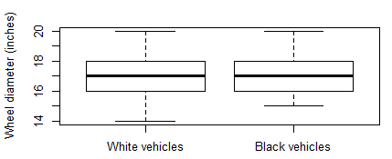
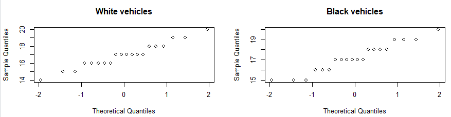

**Black and white – is there really a difference?**

**An observational study of vehicle wheel sizes.**

Abstract
--------

*This report seeks to answer the following question: Do black vehicles have a
greater mean wheel diameter than white vehicles? The underlying, safe assumption
in this regard is that there is no significant difference in mean wheel diameter
between black vehicles and white vehicles (null-hypothesis). This paper reports
on an observational, statistical investigation that was performed based on two
independent, random samples for vehicles (one sample for black vehicles and the
other for white vehicles). The samples were drawn from a very specific
population of vehicles and great care was taken to ensure that the samples were
as close as possible to a simple random samples (SRS). The samples’
distributions facilitated in utilising the t-test.  The statistical
investigation suggests a moderate relationship between the reported vehicle
colours and mean wheel sizes.  So, can the choice of vehicle colour lead the
consumer to favour a different wheel size? This report suggests that it might
not be the case.*

Introduction
------------

Picking a vehicle colour is never an easy choice and buyers are usually trapped
between their emotions and their practicality with many of them wondering,
“…should I go for the *bad-ass* black or the more sensible and *safe* white?” .
According to news.com.au around 15% of all vehicles on Australian roads are
black and 21% white . On the surface it seems to be a close split between the
adventurous buyers and the practical buyers. Black is usually associated with
high performance and/or luxurious vehicles as opposed to white vehicles being
associated with average performance and/or standard vehicles. Apart from vehicle
performance, there is also a safety aspect to consider – white is a more visible
colour. Then, there are some practical aspects to consider – black vehicles tend
to show dirt easier (or so it is perceived by the general populous\*) and black
vehicles have excessively warmer interiors since black doesn’t reflect any
sunlight. The choice between a black or white coloured vehicle is a subtle
social difference that may or may not lead to the average buyer’s choice of
wheels fitted to the vehicle. This then, is also the main motivation for this
investigation. From this background information and the general assumption that
**black** vehicles have a **greater** average wheel diameter than white
vehicles, the following hypotheses are drawn:

Null hypothesis: H0 : µblack = µwhite

Alternative hypothesis: HA : µblack \> µwhite

µblack = mean rim diameter for black vehicles.

µwhite = mean rim diameter for white vehicles.

*\*The only vehicle which hides dirt the best is most likely a dirt coloured
vehicle…? [Author’s note]*

This document reports on a statistical method that evaluates the above stated
hypotheses and, in the process, seeks to better understand the correlation
between black and white vehicles and those two groups’ wheel sizes (diameter of
the rim). Two random data samples (one for black vehicles and another for white
vehicles) were collected by ways of observation and several measures were put in
place to minimize bias and sampling errors.

Data
----

The following table lists the details of the two independent samples captured
during the study.

Table 1 – Data Details

| **Details**            |                                                                                                                                                   |
|------------------------|---------------------------------------------------------------------------------------------------------------------------------------------------|
| Study type             | Observational                                                                                                                                     |
| Population             | All motor vehicles parked in the parking lots of the Westfields Mall in Knox City on Wednesday morning, 1 August 2018, between 10am and 11am. |
| Sample sizes           | Sample 1: 20 black vehicles. Sample 2: 20 white vehicles.
| Variables              | Explanatory variable: Vehicle colour – categorical (nominal). Response variables: Wheel rim diameter – quantitative (numerical).
| Exclusion or groupings | None.                                                                                                                                             |
| Covariates             | Gender of vehicle owner (The person who bought the vehicle). Weather on the day of the sample being taken. Night time sampling. It may be considered that individuals with higher earning capacity visit malls in the evening purely for entertainment reasons. Higher earning individuals may be considered to have a different vehicle purchasing profile than lower earning individuals.
| Data collectors               | Person B: White vehicles. Person A: Black vehicles                                                                                                                          

The wheel rim diameter (response variable - b in Table 1) is read directly from the sampled vehicle’s tyre code. E.g. from the wheel code: 185/65R15, the R15 implies that the rim diameter is 15 inches. This then, is the number recorded for the sample. The following procedures were put in place to reduce bias. Firstly, a very specific geographical boundary was chosen for the population - Westfields mall parking lot at Knox City centre. Secondly, a narrow timeslot was set for sampling. It was impossible to ensure that the population did not change over the course of the data collection time slot (10am -11am). The only way to ensure that, would have been to lock down the parking lot for an hour. That would have caused panic, mayhem and widespread riots and probably landed the data capturers in custody. So, a small margin of population turnover, i.e. an error of approximately 3%, must be taken into consideration for vehicles entering and existing during the data collection time slot. The exact number of parking spaces at Westfields mall, as sourced from the centre’s management, is 6000. A random number generator was then utilized to generate 20 random numbers from a uniform distribution - one set for black vehicles and another set for white vehicles. The random numbers correlate to physical locations in the parking lots. If neither a black nor white vehicle was parked in the randomly chosen position, then the next random number is selected and so forth. For a parking lot with 6000 spaces it is impractical to try and capture more than 20 vehicles in 1 hour, hence the sample size of 20 was chosen. In this regard the experimental setup had to sacrifice specificity to enhance the SRS aspect of the samples.

Methods
-------

The R-Studio analytical software package, version 1.1.453, was utilized to analyse the data. The captured results were entered into R-data-frames and initial EDA was done utilising the following R commands: *c, table, qqnorm, hist, boxplot* and *summary*. Initial EDA suggested that both the samples’ distributions were normal. Since two independent samples, which both conforms to normal distributions is used in this analysis, the **t-test** was chosen to determine whether there is a significant statistical difference between the two samples . 

To **reject** the **null-hypothesis** and to avoid committing a **type I** error, a **significance level** of 5% is chosen (α = 0.05). By utilising the following R commands: *mean, sd* and *var*, both the samples’ means, standard deviations and variances were calculated. From these calculations it was noticed that the variances for the two samples differed and therefore the t.test function’s parameter: **var.equal=false**. The setup of the null-hypothesis resulted in setting the t.test function’s parameter: **alternative=”greater”**. From this statistical test method and by utilising the listed R commands a conclusive statistical result was determined.

Results and Discussion
----------------------

From Table 1, which lists the basic statistical properties of the two samples, it can be observed that the sample for the black vehicles has a higher mean than the sample for the white vehicles and that the two samples have different variances. The first part of the latter observation adds support towards the alternative hypothesis. 

Table 2 – Black and White Sample statistics

|                    | **Min** | **1st Qu** | **Median** | **Mean** | **3rd Qu** | **Max** | **Variance** |
|--------------------|---------|------------|------------|----------|------------|---------|--------------|
| **White Vehicles** | 14.0    | 16.0       | 17.0       | *16.9*   | 18.0       | 20.0    | 2.20         |
| **Black Vehicles** | 15.0    | 16.0       | 17.0       | *17.2*   | 18.0       | 20.0    | 2.06         |

From Figure 1, it can be observed that the 1st and 3rd quartiles of both samples are very much the same and that there are no outliers for any of the two samples. 



Figure 1 – Black and White boxplots

From Figure 2, it can be observed that both samples have relatively normal
distributions. From that observation it can be deduced that the larger
population of motor vehicles from which the samples where collected, is also
normally distributed .



Figure 2 – Black and White Quartile plots

From the results of the t-test, as listed in Table 3, it can be observed that a
p-value of 0.2599 was calculated with 37.961 degrees of freedom (df = 37.961).
This p-value is much larger than the initially set confidence level of α = 0.05.
This is a **strong indication** to **not reject the null-hypothesis**.
Therefore, there is **no statistically significant difference** between the two
samples captured for this study.

Table 3 - T.Test Results

| **Parameter**           | **Value**       |
|-------------------------|-----------------|
| t                       | 0.64979         |
| df                      | 37.961          |
| **p-value**             | **0.2599**      |
| 95% Confidence interval | \-0.4784088 Inf |

Conclusions
-----------

Even though the black vehicle sample had a higher mean value than the white
vehicle sample, the t-test results conclusively showed that there is no real
significant statistical difference between the two samples **(p-value \> α)**.
Given the small sample sizes (20), it would be interesting to see what results a
larger sample size would generate. Even though it seems that the general
populous seems to think that black cars have larger wheel diameters than white
cars, this statistical analysis suggests otherwise.

Appendix A
==========

Samples
-------

| **Black Vehicles** | **White Vehicles** |              |     |            |              |
|--------------------|--------------------|--------------|-----|------------|--------------|
| No.                | Random No.         | Rim Diameter | No. | Random No. | Rim Diameter |
| 1                  | 196                | 17           | 1   | 110        | 16           |
| 2                  | 436                | 15           | 2   | 816        | 17           |
| 3                  | 767                | 15           | 3   | 2520       | 17           |
| 4                  | 970                | 19           | 4   | 2613       | 19           |
| 5                  | 1219               | 17           | 5   | 2753       | 17           |
| 6                  | 1298               | 18           | 6   | 2928       | 15           |
| 7                  | 1723               | 18           | 7   | 2944       | 14           |
| 8                  | 2129               | 15           | 8   | 3073       | 19           |
| 9                  | 2158               | 17           | 9   | 3507       | 17           |
| 10                 | 2607               | 19           | 10  | 3986       | 16           |
| 11                 | 3431               | 20           | 11  | 4356       | 18           |
| 12                 | 3888               | 18           | 12  | 4410       | 17           |
| 13                 | 4477               | 16           | 13  | 4692       | 20           |
| 14                 | 4802               | 17           | 14  | 3892       | 15           |
| 15                 | 5090               | 17           | 15  | 5038       | 17           |
| 16                 | 5148               | 18           | 16  | 5102       | 16           |
| 17                 | 5638               | 16           | 17  | 5310       | 16           |
| 18                 | 5699               | 17           | 18  | 5504       | 18           |
| 19                 | 5866               | 19           | 19  | 5884       | 18           |
| 20                 | 5956               | 16           | 20  | 5972       | 16           |








